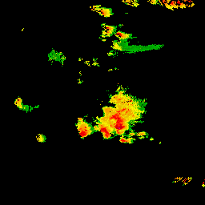

Implementation of Steiner and Smith Radar Quality-Control Algorithm
===================================================================

The quality-control algorithm of Steiner and Smith [1] is a hand-built decision
tree with five binary decision nodes. The features are hand-crafted and include
the reflectivity value, echo top, spin change, and the vertical gradient.

The following table contains the results of our implementation on the data
sets from the paper (see Figures 4 - 8 in the paper).

<table>
<tr><th>Original Radar Image</th><th>Quality-Controlled Radar Image</th></tr>
<tr>
<td>
<td>
<tr>
<tr>
<td>
<td>
<tr>
<tr>
<td>
<td>
<tr>
<tr>
<td>
<td>
<tr>
<tr>
<td>
<td>
<tr>
</table>

Test
----

Run the following command to generate the images shown in the table above:

	$ python2 steiner_smith.py

The outputs are written to `img/`.

Notes
-----

- I could not reproduce the results from the paper with the default parameters.
  In particular, I had to changed GRADthresh from 10 dBZ/deg to 20 dBZ/deg to
  match the result from the paper.

References
----------

[1] M. Steiner and J. Smith, "Use of three-dimensional reflectivity structure
for automated detection and removal of non-precipitating echoes in radar data,"
J. Atmos. Ocea. Tech., vol. 19, no. 5, pp. 673–686, 2002.
